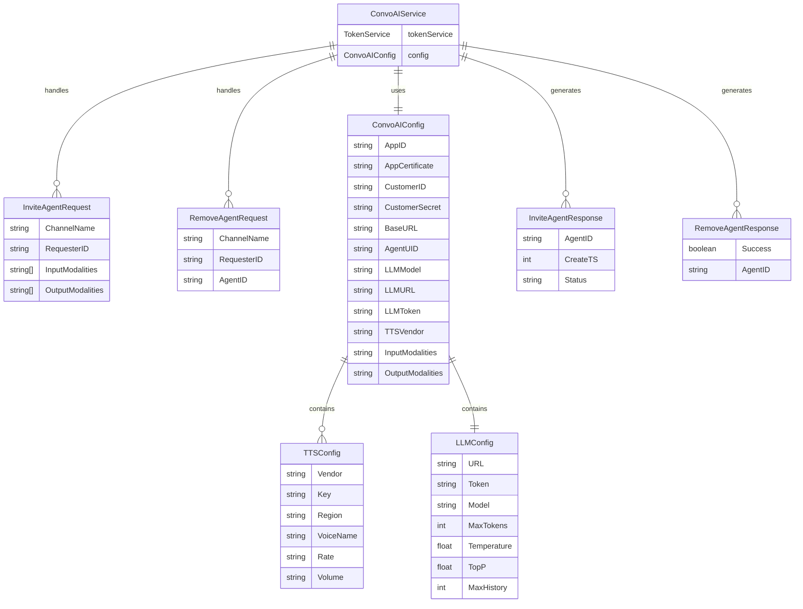

# ConvoAI Service Entity Relationship Diagram

## Entity Descriptions

### ConvoAIService

- Main service that handles AI agent operations
- Manages configuration and token service integration

### ConvoAIConfig

- Holds all configuration parameters for the service
- Includes Agora credentials, LLM settings, and TTS configuration

### Request Entities

- **InviteAgentRequest**: Parameters for inviting an AI agent
- **RemoveAgentRequest**: Parameters for removing an AI agent

### Response Entities

- **InviteAgentResponse**: Contains agent details after successful invitation
- **RemoveAgentResponse**: Contains removal operation status

### Configuration Entities

- **TTSConfig**: Text-to-Speech configuration (supports multiple vendors)
- **LLMConfig**: Language Model configuration and parameters

## Relationships

- ConvoAIService handles both invite and remove requests
- Each request generates a corresponding response
- Service uses a single configuration instance
- Configuration can contain multiple TTS configurations
- All operations require proper authentication and configuration
