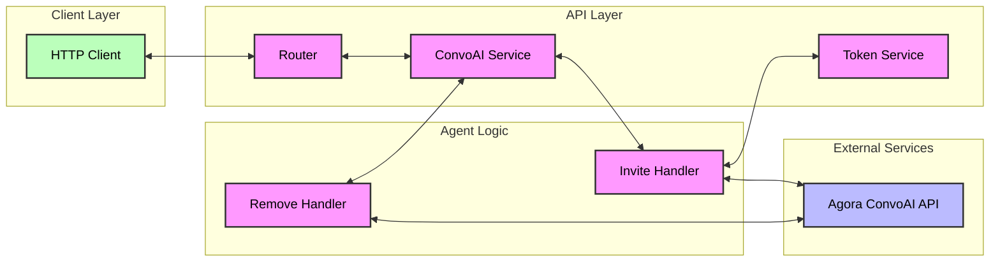

# ConvoAI Service Flow Diagram

## Service Flow Description

1. **Client Request**

   - Client sends HTTP request to invite or remove an AI agent

2. **Router Processing**

   - Gin router directs request to appropriate ConvoAI Service handler

3. **Invite Flow**

   - Validates request
   - Generates RTC token
   - Configures TTS and LLM settings
   - Calls Agora ConvoAI API to start agent
   - Returns agent details to client

4. **Remove Flow**

   - Validates request
   - Calls Agora ConvoAI API to remove agent
   - Returns success status to client

5. **Configuration**
   - Uses environment variables for service configuration
   - Supports multiple TTS vendors
   - Configurable LLM parameters
