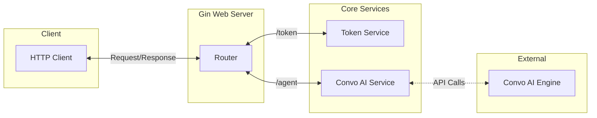

# convo-ai-go-server

Example of a golang based micro-service that handle interacting with Agora's Conversational AI RESTful API.

## How to Run

Create a `.env` and set the environment variables.

```bash
cp .env.example .env
```

```bash
go run cmd/main.go
```

### Health Check

- GET `/ping`

  - Response:

  ```json
  {
    "message": "pong"
  }
  ```

## Micro-Service Architecture



for more detailed flow diagrams, please refer to the [ConvoAI Service Flow](DOCS/ConvoAI_Service_Flow.md) & and [Token Service Flow](DOCS/Token_Service_Flow.md)

## API Endpoints

### Token

- POST `/token/getNew`

  - Request:

  ```json
  {
    "tokenType": "rtc",
    "channel": "test-channel",
    "role": "publisher",
    "uid": "user-123",
    "expire": 3600
  }
  ```

  - Response:

  ```json
  {
    "token": "eyJhbGciOiJIUzI1NiIsInR5cCI6IkpXVCJ9..."
  }
  ```

### Agent

- POST `/agent/invite`

  - Request:

  ```json
  {
    "channelName": "test-channel",
    "requesterId": "user-123"
  }
  ```

  - Response:

  ```json
  {
    "agent_id": "1NT29X0XUN1CFS1VJBS11RAFSJFYBMOW",
    "create_ts": 1739905500,
    "status": "RUNNING"
  }
  ```

- POST `/agent/remove`
  - Request:
  ```json
  {
    "channelName": "test-channel",
    "requesterId": "user-123"
  }
  ```
  - Response:
  ```json
  {
    "success": true,
    "agent_id": "1NT29X0XUN1CFS1VJBS11RAFSJFYBMOW"
  }
  ```

## CURL Examples

- [Invite Agent](DOCS/ConvoAI_Service_cURL.md#invite-agent)
- [Remove Agent](DOCS/ConvoAI_Service_cURL.md#remove-agent)

## Entity Relationship Diagrams

- [ConvoAI Service](DOCS/ConvoAI_Service_Entity.md)
- [Token Service](DOCS/Token_Service_Entity.md)

## Contributing

Cntributions are welcome, fork the project and make a PR with your updates. Please refer to the [CONTRIBUTING.md](CONTRIBUTING.md) for more details.

## License

This project is licensed under the MIT License. See the [LICENSE](LICENSE) file for details.
